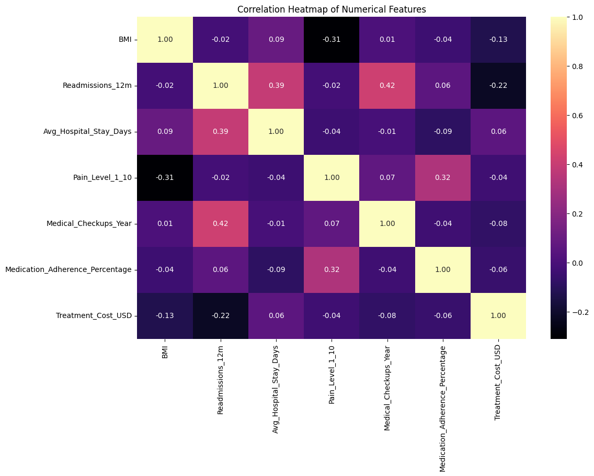

# Healthcare Predictive Analytics 

This repository contains my MSc Data Analytics thesis project focused on applying predictive analytics and machine learning techniques in the healthcare domain to support data-driven diagnosis and healthcare decision-making.

---

## Project Overview

Healthcare systems generate large volumes of patient data that can be used to improve clinical decision-making. This project investigates how predictive analytics can be applied to healthcare datasets to identify patterns in patient information and support accurate diagnosis.

The project includes the full data analytics workflow: data preprocessing, exploratory data analysis (EDA), feature engineering, machine learning model training, and model evaluation.

Multiple machine learning models were implemented and compared to determine the most effective approach for predictive analysis.

---

## Objectives

The main objectives of this project are:

- Clean and preprocess healthcare data for machine learning analysis
- Perform exploratory data analysis to understand key patterns in the data
- Develop meaningful features for predictive modeling
- Implement and compare multiple machine learning models
- Evaluate model performance using appropriate evaluation metrics

---

## Dataset

The dataset used in this study was collected through a structured healthcare survey and contains patient-related attributes including:

- Age
- Gender
- Body Mass Index (BMI)
- Chronic conditions
- Hospital readmissions within 12 months
- Average hospital stay duration
- Pain level
- Frequency of medical check-ups
- Medication adherence percentage
- Treatment cost (USD)

---

## Project Workflow

The project follows a structured data analytics pipeline:

1. Data Collection  
2. Data Cleaning and Preprocessing  
3. Column Renaming and Feature Preparation  
4. Encoding and Feature Scaling  
5. Exploratory Data Analysis (EDA)  
6. Machine Learning Model Development  
7. Model Evaluation  
8. Feature Importance Analysis

---

## Technologies Used

The project was implemented using the following tools and libraries:

- Python
- Pandas
- NumPy
- Scikit-learn
- Matplotlib
- Seaborn
- Jupyter Notebook

---

## Example Visualization

Below is an example correlation heatmap used during exploratory data analysis to identify relationships between variables.

---

## Machine Learning Models Implemented

The following machine learning models were used and evaluated:

- Logistic Regression
- Support Vector Machine (SVM)
- Random Forest
- Decision Tree (baseline comparison)

---

## Key Findings

- Data preprocessing involved handling missing values and renaming variables for clarity.
- The cleaned dataset used in the analysis contained **48 records and 10 features**.
- The **Random Forest model achieved the best predictive performance** among the tested models.
- Important predictive variables included **readmissions and patient age**.

---

## Limitations

Some limitations of this project include:

- The dataset size was relatively small, which may limit model generalization.
- Data was collected through a survey, which may introduce response bias.
- Additional healthcare variables could further improve predictive accuracy.

---

## Future Improvements

Future work could include:

- Using larger and more diverse healthcare datasets
- Applying deep learning models for more complex prediction tasks
- Implementing explainable AI techniques such as SHAP or LIME
- Developing a healthcare decision-support application based on the trained model

---

